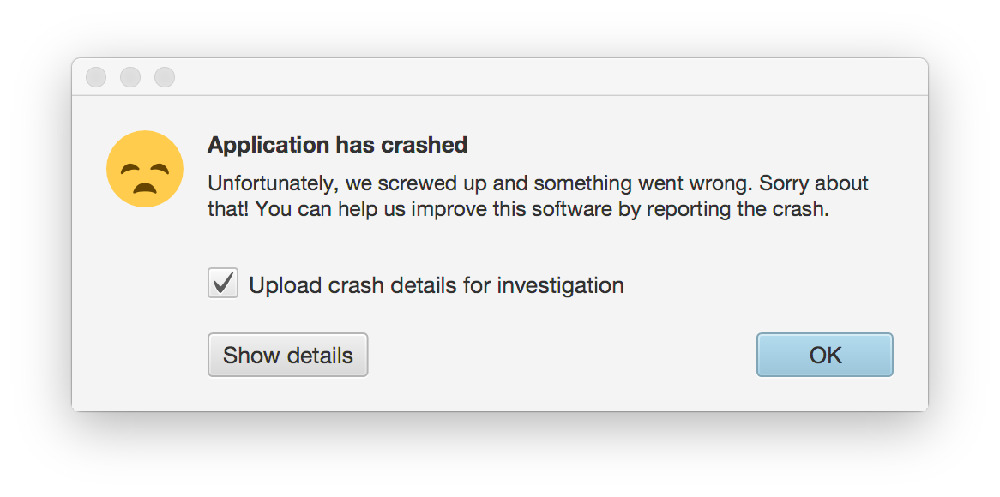
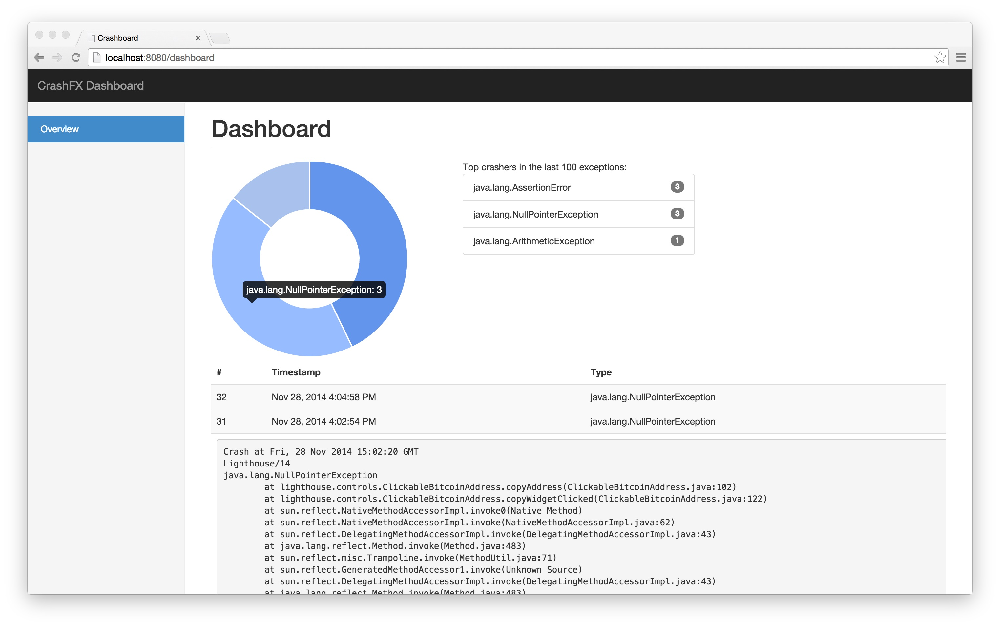

CrashFX
-------

CrashFX is a small, simple library and web app to gather and analyse crash reports from JavaFX applications. It provides:

- A small client library that can will display a crash alert dialog with optional viewing of the stack trace, and which
  saves crash logs to disk for later background upload.
- A small web app that collects crash reports, inserts them into a database (any supported by Hibernate will do) and
  can draw a dashboard showing recent exceptions and a pie chart of which types are most common.

CrashFX is Apache 2.0 licensed. You can use it in commercial apps without restriction. If you would like commercial
support or to use the vinumeris.com crash collector and dashboard, please [contact us](mailto:contact@vinumeris.com).

Maven coordinates
-----------------

| Group ID            | Artifact ID    | Version |
| :-----------------: | :------------: | :-----: |
| com.vinumeris       | crashfx-client | 1.0     |

How to integrate
----------------

Near the start of your application, call

```java
CrashFX.setup("MyApp v1.0", Paths.get("path/to/working/dir"), URI.create("https://www.example.com/path/to/crashfx/upload");
```

This method sets the uncaught exception handler on the calling thread, and the default uncaught exception handler for
all new threads created after that point. Thus any threads started before this call won't have crashes caught. You can
set the uncaught exception handler on any previous threads manually: just call CrashWindow.open(throwable) from it.

Any crash that happens will open up a reporting dialog that gives the user the option of uploading a crash report:



The first parameter will be used as the User-Agent header when crash reports are submitted, and also included in the
report. The second parameter will be used to save crash reports to disk. For robustness and speed, when a crash happens
it's not reported right away. Instead it's stored to disk. The next time your app starts and CrashFX.setup is called
the reports will be uploaded in the background via HTTP POST to the URI provided in the third parameter.

If all you care about is the crash dialog and not report uploading functionality, use the no-args `CrashFX.setup()`
call.

And that's it! CrashFX will add a JDK logging handler so that crash reports include the last 1000 lines of log data.
If you don't use JDK logging then you can do the equivalent operation and use CrashFX.recordLogLine().

The CrashFX class also has a handful of utility methods to make working with Java 8 more pleasant:

* `CrashFX.getStackTrace(throwable)` returns a stack trace as a string.
* `CrashFX.propagate(throwable)` either rethrows the given exception immediately if it's a subclass of RuntimeException
  or Error, or wraps it in RuntimeException and rethrows.
* `CrashFX.unchecked(function)` and `CrashFX.uncheck(function)` take a function that can throw a checked exception and
  propagates anything thrown as a RuntimeException (see propagate). This simplifies Java syntax considerably when you
  would prefer to crash than handle an exception. For example, instead of writing:

  ```java
  try {
    byte[] bits = Files.readAllBytes(path);
  } catch (IOException e) {
    throw new RuntimeException(e);
  }
  ```

  you can simply write:

  ```java
  byte[] bits = unchecked(() -> Files.readAllBytes(path));
  ```

  When there is no result to return, use `uncheck` instead of `unchecked`.
* `CrashFX.ignoreAndLog(function)` and `CrashFX.ignoreAndLogged(function)` are a similar pair of functions that simply
  log the stack trace using the global CrashFX.LOGGER function, which by default prints to stderr. For the
  `ignoreAndLogged` variant that returns a result, if there's an exception it returns null.
* `CrashFX.didThrow(function)` simply returns true if an exception was thrown by the given function and false otherwise.
  This is useful for input validation code.

Finally there's also a method to list files in a directory, that simplifies the java nio Files API for doing the same.

Limitations
-----------

CrashFX cannot currently report faults that crash the JVM itself.

The analytics web app is rudimentary and requires a database.

How to run the web app
----------------------

The web app is based on the [Ninja Framework](http://www.ninjaframework.org), and written in Kotlin. Despite that it
is all Maven based and has a standalone mode. It is set up for a PostgreSQL backend but the persistence.xml file could
 be tweaked to use any other database backend supported by Hiberate.

Grab the code, then put your database connection details into the `web/src/main/java/conf/application.conf` file. The `dashboardPassword` setting must also be changed to a proper password. Note that the default dashboard username is `admin`. You
 should then run `mvn clean compile ninja:run` from the web directory which will boot up the app in standalone mode, and generate
 a random application secret for you in the application.conf file as well. This is used for cookie signing so please
 don't screw this step up!
 
The above steps will launch Ninja in SuperDevMode (using `dev.*` settings from `application.conf`), ideal for debugging. If you want to deploy the standalone web app in production mode (and apply `prod.*` settings from `application.conf`), do as follows:

1. Set `ninja.mode` to `prod` in `pom.xml`;

2. Run `mvn clean compile assembly:single` in the web directory. This will produce a standalone `crashfx-web-X.X-jar-with-dependencies.jar` jar in the `target` subdirectory, with all dependencies packaged.

3. Launch the standalone web app as a background nohuped daemon: `nohup java -Dninja.port=9000 -jar crashfx-web-X.X-jar-with-dependencies.jar > crashfx-web.log 2>&1 &`

4. For custom Ninja settings and proper setup of the app as a system service, see the [Ninja standalone](http://www.ninjaframework.org/documentation/deployment/ninja_standalone.html) reference.

Finally you can run `mvn package` to get a WAR in the target directory that can be deployed to any Java app server.
Or, just use standalone mode.

It looks like this:


